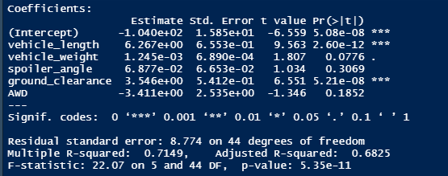
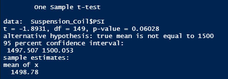
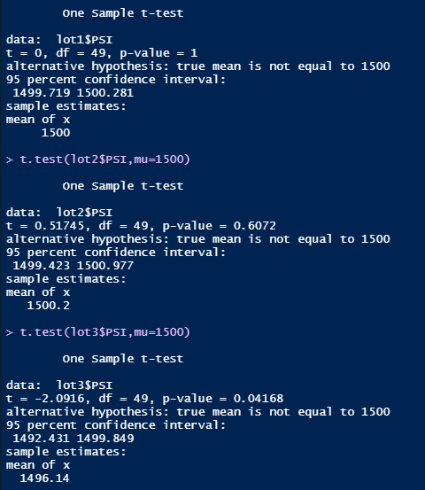

# MechaCar Analysis

## Linear Regression to Predict MPG

Having run a liner regression analysis on the Mecha_car.csv file, we can see how several different factors in the building of a car contribute to its overall MPG. As seen from
the screenshot above, we can determine that both vehicle length, as well as ground clearance, have a significant impact on the MPG rating of our Mecha Car. Conversely, we can
see that vehicle weight, spoiler angle, and AWD have low P values, indicating that they do not have a large impact. Additionally, the R squared value of the overall data set is
high, meaning that this analysis can, for the most part, accurately predict the MPG of Mecha Cars.

## Summary Statistics on Suspension Coils

For the next deliverable, we looked at the data for suspension coils, and were asked to confirm that the variance among suspension coils does not exceed 100 pounds per square
inch. From our overall analysis we can see that the variance is 62.29, which is well within the limits. However, when we break the data into individual manufacturing lots, we
can see that Lot 3 has a variance of 170, which is well above our target. By adjusting processes, increasing training, our altering some other variable in the suspension coils,
we can reduce this number for Lot 3, as well as for the data set as a whole.

## T-Tests on Suspension Coils

Next, we ran a one sample T-test on the suspension coils in order to see if their mean was statistically similar to the presumed mean of 1500. As seen in the above screenshot
the mean of the sample is 1498.78, which is close to the presumed mean. Additionally, the P Value is above the significance level of 0.05, meaning that these manufacturing lots
are indeed, statistically similar to the presumed population mean. 

When broken down by manufacturing lot, both lot 1 and lot 2 tell a similar story to the overall analysis. Lot 3 however has a lower P-value, and it is evident that something is
wrong. Mecha Car production teams should take a closer look as to what is going awry in this area. 

## Study Design: MechaCar vs Competition

For my own study, I would be interest in looking at Mecha Cars pricing to comparable models from different manufacturers. A few years of data would be collected from all auto
manufacturers who offer comparable models, including current prices, safety features, mpg, resale value, and all other factors consumers look at when purchasing a vehicle.
Multiple linear analysis would then be performed in order to determine which of these factors has the highest impact on price. The null hypothesis would be that Mecha Cars are 
priced correctly based on these factors, with the alternative hypothesis being that it is not.
